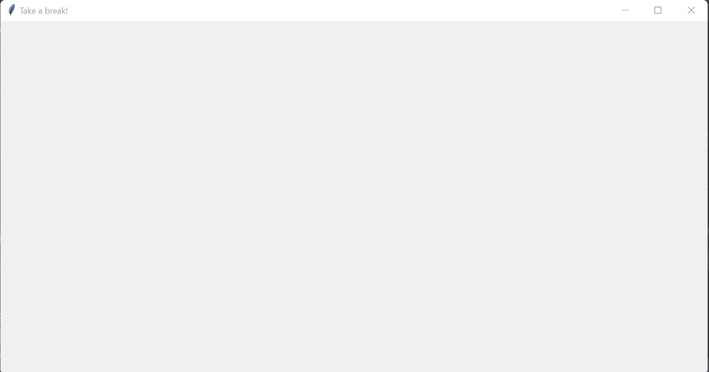

# eye-protector
A simple python script to show a popup every interval

### Installation requirements
Only python is needed! 
No pip installs necessary

### How to run
To run, just run `alarm.py` in your command line.

Every BREAK_INTERVAL minutes, this popup will show to remind you to take a break

